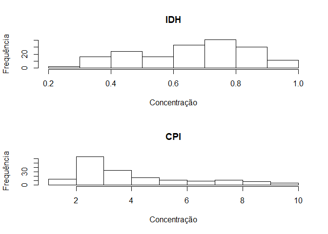

Aula Prática - Matemática Instrumental
================
Lucas Mascarenhas Almeida
17 de abril de 2018

<center>

[](http://www.gamma.ufba.br/)

</center>

# A aula prática de Introdução ao R

## O que é o **R** ?

<p style="text-align: justify">

O [R](https://cran.r-project.org/) é uma linguagem de programação do
tipo software livre bastante popular no meio acadêmico com foco em
análises estatísticas e gráficas. A ferramenta possui facilidade,
robustez e qualidade na produção das análises e gráficos, incluindo uma
grande diversidade de pacotes que permitem que o usuário detenha total
controle do que esta sendo produzido.

</p>

<center>

[](https://www.rstudio.com/)

</center>

Para baixar o **R** e o **Rstudio** acesse:

  - R: <https://cran.r-project.org/>
  - Rstudio: <https://www.rstudio.com/>

### Pulo do gato\!


<p style="text-align: justify">

Alguns sites e materiais que podem ser de grande utilidade pra quem está
conhecendo o mundo do R:

</p>

  - [Stack Overflow](https://stackoverflow.com/). Fundada em 2008, o
    Stack Overflow é a maior e mais confiável comunidade online voltada
    para programação.
  - [Google’s R Style
    Guide](https://google.github.io/styleguide/Rguide.xml). O objetivo
    do Google’s R Style Guide é tornar o seu código em R mais fácil de
    ler, compartilhar e verificar.
  - [Rpubs](https://rpubs.com/L_Mascarenhas/). Um ambiente para
    publicação de documentos a partir de R.
  - [R-bloggers](https://www.r-bloggers.com/). Um site que reúne os
    blogueiros que escrevem sobre R.
  - [R no
    Facebook](https://www.facebook.com/groups/1410023525939155/?ref=bookmarks).
    Comunidade do facebook (R Brasil - Programadores).
  - [R for Data Science](http://r4ds.had.co.nz/). Livro que propõe
    ensinar o data science no R.

## Aula prática - Introdução ao **R**

### Primeiros Passos

  - Estatística descritiva no R (Pacote Base): Funções estatísticas e
    representações gráficas.
  - Importação de banco de dados (Pacote
    [**readxl**](https://www.rdocumentation.org/packages/readxl/versions/1.0.0)).

<p style="text-align: justify">

O primeiro passo é criar uma pasta exclusiva para o novo script e
apontar esta pasta como o diretório de trabalho.

</p>

``` r
# Apontando para a pasta de trabalho

setwd("C:/Users/lukas/codes_old/R - Codes/Aulas - ENGD02/Compilado")
```

<p style="text-align: justify">

Após criar o script, salvar na pasta dedicada ao projeto e apontar o
diretório de trabalho, devemos instalar e chamar todos o pacotes que
serão utilizados durante o desenvolvimento do código.

</p>

``` r
# Chamando biblioteca, se ainda nao estiver instalada use, ex: install.packages("ggplot2")

if(!require("readxl")) install.packages("readxl") ; library(readxl)
if(!require("dplyr")) install.packages("dplyr") ; library(dplyr)
if(!require("ggplot2")) install.packages("ggplot2") ; library(ggplot2)
```

<p style="text-align: justify">

Com os procedimentos iniciais cumpridos, vamos para o desenvolvimento do
código.

</p>

<p style="text-align: justify">

Funções da estatística descritiva:

</p>

``` r
# Conceitos basicos----

# Criando um vetor

vetor = c(8, 10, 15, 35, 40, 3, 19, 10, 34, 7)

## Medidas de localizacao

media <- mean(vetor)
mediana <- median(vetor)
quartil <- quantile(vetor)
resumo <- summary(vetor)

## Medidas de variabilidade

desvio <- sd(vetor)
variancia <- var(vetor)
CV <- (desvio/media)*100
```

<p style="text-align: justify">

Importando banco de dados:

</p>

``` r
# Importando banco de dados----

dados <- read_excel("C:/Users/lukas/codes_old/R - Codes/Aulas - ENGD02/Compilado/data/EconomistData.xlsx",col_types = c("text", "numeric", "numeric", "numeric", "text"))
```

<p style="text-align: justify">

Como foi apresentado em sala, em versões iguais ou superiores a do R
3.4.3 e do Rstudio 1.1.423 é possível importar um banco de dados do
excel utilizando o atalho *import Dataset* que fica na aba
*Environment*.

</p>

<center>


</center>

<p style="text-align: justify">

Também é possível importar um banco de dados do tipo csv ou txt através
do atalho *import Dataset* que fica na aba *Environment*, basta
selecionar a opção *From Text*.

</p>

<center>


</center>

<p style="text-align: justify">

O banco de dados utilizado durante a aula apresenta o Índice de
Desenvolvimento Humano (HDI) e o Índice de Percepção de Corrupção (CPI)
para vários países. São dados do [Transparency
International](https://www.transparency.org/).

</p>

<p style="text-align: justify">

Representação gráfica utilizando o pacote base.

</p>

``` r
# representacao grafica----

## Histograma

par(mfrow = c(2,1))

hist(dados$HDI, main = "IDH", xlab = "Concentração", ylab = "Frequência")
hist(dados$CPI, main = "CPI", xlab = "Concentração", ylab = "Frequência")
```

<center>

<!-- -->

</center>

``` r
## Box-plot

par(mfrow = c(1,2))

boxplot(dados$HDI, main = "IDH")
boxplot(dados$CPI, main = "CPI")
```

<center>

<!-- -->

</center>

``` r
## Dispersao

par(mfrow = c(1,1))

plot(dados$CPI, dados$HDI, main = "IDH vs. IPC", xlab = "IPC", ylab = "IDH", type = "p")
```

<center>

<!-- -->

</center>

### Nova programação em R:

  - Manipulação de dados (Pacote
    [**dplyr**](https://www.rdocumentation.org/packages/dplyr/versions/0.5.0)).
  - Representação gráfica (Pacote
    [**ggplot2**](http://ggplot2.tidyverse.org/reference/)).

#### Manipulando e Exportando dados:

<p style="text-align: justify">

Manipulação do banco de dados é um grande desafio para quem trabalha com
big data. O pacote
[**dplyr**](https://www.rdocumentation.org/packages/dplyr/versions/0.5.0)
apresenta algumas funções que otimizam as manipulações.

</p>

``` r
# Manipulando e Exportando dados----

## Usando dplyr

dados_exp <- dados %>% 
  group_by(Region) %>% 
  mutate(M.CPI = mean(CPI), M.HDI = mean(HDI), Var.CPI = var(CPI)) %>% 
  select(Region, M.CPI, M.HDI, Var.CPI, Country) %>% 
  filter(M.CPI < 4.5)
```

<p style="text-align: justify">

Exportando dados:

</p>

``` r
## Exportando dados

write.csv2(x = dados_exp, file = "dados_paises.csv")
```

#### Representação de dados:

<p style="text-align: justify">

O pacote [**ggplot2**](http://ggplot2.tidyverse.org/reference/) fornece
um poderoso modelo de gráficos que facilita a produção de gráficos
multi-camadas.

</p>

<p style="text-align: justify">

Gráfico de dispersão:

</p>

``` r
# Representacao grafica (ggplot2)----

gg.1 <- ggplot(data = dados, mapping = aes(x = CPI, y = HDI)) +
  geom_point(mapping = aes(color = Region, size = HDI.Rank))

gg.1
```

<center>

<!-- -->

</center>

<p style="text-align: justify">

Adicionando outras funções:

</p>

``` r
gg.2 <- ggplot(data = dados, mapping = aes(x = CPI, y = HDI)) +
  geom_point(mapping = aes(color = HDI.Rank)) +
  facet_wrap(facets = ~Region, nrow = 2) +
  geom_smooth(method = "lm") +
  theme_light()

gg.2
```

<center>

<!-- -->

</center>

<p style="text-align: justify">

Salvando os gráficos:

</p>

``` r
# Salvando os graficos

ggsave(filename = "grafico1.png", plot = gg.1, width = 13, height = 7, dpi = 500)
```

### Script completo:

``` r
# Apontando para a pasta de trabalho

setwd("C:/Users/lukas/codes_old/R - Codes/Aulas - ENGD02/Compilado")

# Chamando biblioteca, se ainda nao estiver instalada use, ex: install.packages("ggplot2")

if(!require("readxl")) install.packages("readxl") ; library(readxl)
if(!require("dplyr")) install.packages("dplyr") ; library(dplyr)
if(!require("ggplot2")) install.packages("ggplot2") ; library(ggplot2)

# Conceitos basicos----

# Criando um vetor

vetor = c(8, 10, 15, 35, 40, 3, 19, 10, 34, 7)

## Medidas de localizacao

media <- mean(vetor)
mediana <- median(vetor)
quartil <- quantile(vetor)
resumo <- summary(vetor)

## Medidas de variabilidade

desvio <- sd(vetor)
variancia <- var(vetor)
CV <- (desvio/media)*100

# Importando banco de dados----

dados <- read_excel("C:/Users/lukas/codes_old/R - Codes/Aulas - ENGD02/Compilado/data/EconomistData.xlsx",col_types = c("text", "numeric", "numeric", "numeric", "text"))

# representacao grafica----

## Histograma

par(mfrow = c(2,1))

hist(dados$HDI, main = "IDH", xlab = "Concentração", ylab = "Frequência")
hist(dados$CPI, main = "CPI", xlab = "Concentração", ylab = "Frequência")

## Box-plot

par(mfrow = c(1,2))

boxplot(dados$HDI, main = "IDH")
boxplot(dados$CPI, main = "CPI")

## Dispersao

par(mfrow = c(1,1))

plot(dados$CPI, dados$HDI, main = "IDH vs. IPC", xlab = "IPC", ylab = "IDH", type = "p")

# Manipulando e Exportando dados----

## Usando dplyr

dados_exp <- dados %>% 
  group_by(Region) %>% 
  mutate(M.CPI = mean(CPI), M.HDI = mean(HDI), Var.CPI = var(CPI)) %>% 
  select(Region, M.CPI, M.HDI, Var.CPI, Country) %>% 
  filter(M.CPI < 4.5)

## Exportando dados

write.csv2(x = dados_exp, file = "dados_paises.csv")

# Representacao grafica (ggplot2)----

gg.1 <- ggplot(data = dados, mapping = aes(x = CPI, y = HDI)) +
  geom_point(mapping = aes(color = Region, size = HDI.Rank))

gg.1

gg.2 <- ggplot(data = dados, mapping = aes(x = CPI, y = HDI)) +
  geom_point(mapping = aes(color = HDI.Rank)) +
  facet_wrap(facets = ~Region, nrow = 2) +
  geom_smooth(method = "lm") +
  theme_light()

gg.2

# Salvando os graficos

ggsave(filename = "grafico1.png", plot = gg.1, width = 13, height = 7, dpi = 500)
```

## Referências:

  - <http://www.estatisticacomr.uff.br/?p=176>
  - <http://tutorials.iq.harvard.edu/R/Rgraphics/Rgraphics.html>
  - <https://rpubs.com/bradleyboehmke/data_wrangling>
  - <http://cyberhelp.sesync.org/data-manipulation-in-R-lesson/2016/07/26/>
